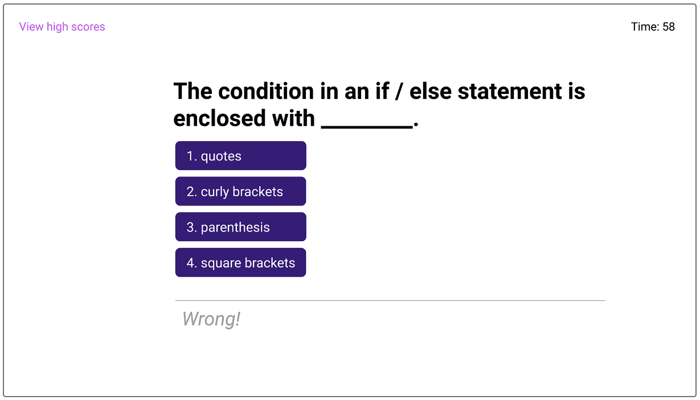

# Web APIs Challenge

## User Story
---
* AS A: coding boot camp student.
* I WANT: to take a timed quiz on JavaScript fundamentals that stores high scores.
* SO THAT: I can gauge my progress compared to my peers.

## Acceptance Criteria
---

### GIVEN: I am taking a code quiz.

* WHEN: I click the start button.
* THEN: a timer starts and I am presented with a question.
* WHEN: I answer a question.
* THEN: I am presented with another question.
* WHEN: I answer a question incorrectly.
* THEN: time is subtracted from the clock.
* WHEN: all questions are answered or the timer reaches 0.
* THEN: the game is over.
* WHEN: the game is over.
* THEN: I can save my initials and score.

## Mock-Up

### Opening Page

 

### Question Page

 

### Scores Page

 

## Deployed Site
---
https://kthomasnj.github.io/webdev-quiz/

### Deployed Site Opening Page

 

### Deployed Site Question Page

 

### Deployed Site Scores Page

 

 
 
 

© 2022 Keith S. Thomas